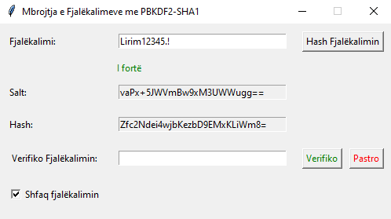

<div align="center">

### UNIVERSITETI I PRISHTINЁS  
### FAKULTETI I INXHINIERISË ELEKTRIKE DHE KOMPJUTERIKE  


### Tema: Mbrojtja e fjalëkalimeve me PBKDF2-SHA1
### Lënda: Siguria e Informacionit
<div align="left"><h3>Mentor: Prof. Dr. Mërgim Hoti</h3></div>

</div>

### Përshkrimi
Ky projekt implementon një metodë për mbrojtjen e fjalëkalimeve duke përdorur algoritmin PBKDF2 me hash-in SHA-1 në Python. PBKDF2 (Password-Based Key Derivation Function 2) përdoret për të gjeneruar çelësa të sigurt dhe është një praktikë standarde për sigurinë e fjalëkalimeve, duke përfshirë salting dhe hashing.

### Karakteristikat
✅ Hashimi i fjalëkalimeve me **PBKDF2-SHA1.** <br>
🔒 Implementimi i një salt të rastësishëm për çdo fjalëkalim. <br>
🛡️ Verifikimi i fjalëkalimeve të ruajtura me hash. <br>

### Ndërfaqja grafike (GUI)
Projekti përdor **Tkinter** për të ofruar një ndërfaqe të thjeshtë dhe të lehtë për përdorim. Përdoruesit mund të: <br>
✍️ Vendosin fjalëkalimin që dëshirojnë të hash-ojnë. <br>
📊 Shikojnë rezultatin e hash-it dhe salt-in e gjeneruar. <br>
✅ Verifikojnë një fjalëkalim duke përdorur hash-in e ruajtur. <br>

### Teknologjitë
🐍 Python <br>
🔒 **hashlib** për hashing dhe **os** për gjenerimin e salt <br>
🖥️ Tkinter për ndërtimin e ndërfaqes grafike (GUI) <br>

### Instalimi
⚙️ Për të ekzekutuar projektin, sigurohu që të kesh Python të instaluar.

### Si të marrim kodin

Për të klonuar projektin, ndiqni këto hapa:

🔓 Hapni terminalin tuaj. <br>
📂 Navigoni në direktorinë ku dëshironi të ruani projektin. <br>
📡 Vendosni këtë komandë për të klonuar repositorin: <br>

   ```bash git clone https://github.com/LirimIslamii/information_security-MSc.git ```

### Ndërfaqja e Tkinter App

<div align="center">
  
</div>

### Kontribuesit

Lirim Islami - https://www.linkedin.com/in/lirim-islami-233897207/ <br>
Arbnor Puka - https://www.linkedin.com/in/arbnorpuka/ <br>
Enis Halilaj - https://www.linkedin.com/in/enis-halilaj-b8724b223/